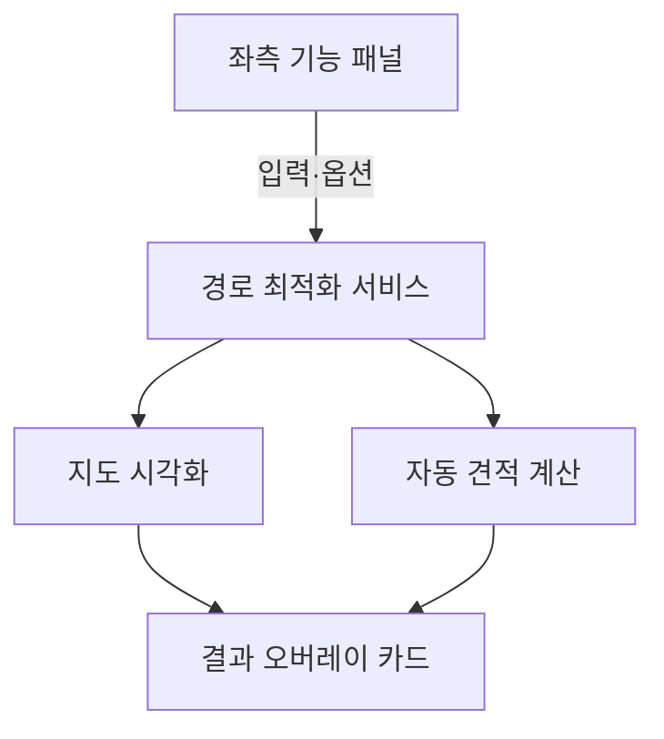

# 디자인 가이드 및 IA (Information Architecture)
## Ongoing Smart Logistics Platform

> **버전**: 1.0
> **최종 수정일**: 2025-01-27
> **적용 범위**: Next.js 15, React, TypeScript, Supabase, Tailwind CSS

> **구문서 안내**: 본 문서의 디자인 시스템·정체성 표준은 [`docs/design-system/north-star.md`](./design-system/north-star.md)와 [`.cursor/rules/30-anti-slop-design.mdc`](../.cursor/rules/30-anti-slop-design.mdc)이 상위이다. 본 문서의 코드 예시 내 OK/금지 메타 마크는 v2 문서화 패스에서 `[OK]`/`[금지]` 텍스트로 통일 예정.

---

## 목차

1. [프로젝트 개요](#프로젝트-개요)
2. [정보 구조(IA) 설계](#정보-구조ia-설계)
3. [디렉토리 구조 및 파일 명명 규칙](#디렉토리-구조-및-파일-명명-규칙)
4. [컴포넌트 설계 원칙](#컴포넌트-설계-원칙)
5. [UI/UX 디자인 가이드라인](#uiux-디자인-가이드라인)
6. [데이터 흐름 및 상태 관리](#데이터-흐름-및-상태-관리)
7. [개발 시 준수사항](#개발-시-준수사항)
8. [품질 보증 체크리스트](#품질-보증-체크리스트)

---

## 프로젝트 개요

### MVP 개발 방향
- **웹앱 우선**: MVP는 웹앱 형태로 개발하여 빠른 출시와 사용자 피드백 수집
- **반응형 디자인**: 데스크톱, 태블릿, 모바일 모든 디바이스에서 최적화된 경험
- **향후 확장**: 웹앱 기반으로 안정화 후 PWA 기능 추가 고려

### 핵심 기술 스택
- **Frontend**: Next.js 15, React, TypeScript, Tailwind CSS
- **Backend**: Supabase (PostgreSQL, Auth, Storage, Edge Functions)
- **외부 API**: Tmap API, Atlan API, Mapbox GL
- **문서/파일**: PDFKit, ExcelJS
- **렌더링**: ISR (Incremental Static Regeneration), Server Actions
- **배포**: Vercel (웹앱 중심)

### 5대 핵심 원칙
1. **가독성과 유지보수성** - 모든 팀원이 쉽게 이해하고 수정할 수 있는 코드
2. **성능 최적화** - 효율적인 리소스 활용과 빠른 사용자 경험
3. **견고성과 신뢰성** - 포괄적인 오류 처리와 검증을 통한 시스템 안정성
4. **보안 우선 설계** - 개발 전 단계에 보안 고려사항 내재화
5. **웹앱 우선 설계** - MVP는 웹앱 중심으로 개발, 향후 PWA 확장 가능

---

## 정보 구조(IA) 설계

### 사이트 IA(지도 중심 SaaS)

본 프로젝트는 기능 선택형 카드 랜딩을 지양하고, "지도 중심 + 좌측 기능 패널 + 지도 위 결과 오버레이" 패턴의 SaaS IA로 전환한다. 핵심 여정은 다음과 같다.

```
사용자 진입(`/`) → 좌측 패널에서 출발/목적지 입력 → [최적화] → 지도에 경로 표시 → 자동 견적 계산 → PDF 다운로드
```

네비게이션 원칙
- 1차 CTA는 항상 "경로 최적화"로 단순화한다.
- 홈(`/`)은 실제 사용 화면이며, 기능 데모(`/test/*`)는 별도 실험 영역으로 분리한다.
- 상단 내비는 기능 영역(견적/배차/추적/관리) 중심으로 유지하되, MVP에서는 비표시 혹은 보조 진입으로 둔다.

공개 라우트 맵(현재/계획)
- `/` 홈: 좌측 패널(경로 최적화, 자동 견적), 우측 전체 화면 지도, 하단/우측 결과 오버레이
- `/test/route-optimization`: 플레이그라운드(실험용)
- `/quote/*`(계획): 자동 견적 상세/이력, PDF/Excel 생성
- `/dispatch/*`(계획): 다차량 배차 최적화
- (제외) `/tracking/*`: 차량 위치/ETA 실시간 갱신 기능은 현 시점 범위에서 제외
- `/admin/*`(계획): 통계/리포트/시스템 설정

레이아웃 구성(개념)


기본 컴포지션
- 좌측 패널: `RouteOptimizerPanel`, `QuoteCalculatorPanel`
- 메인 지도: `TmapMainMap` (경로/마커 렌더링, 지도 상호작용)
- 오버레이: `RouteResultsCard` (요약/액션)

테마 정책
- iOS 글래스 디자인은 라이트 테마만 우선 지원한다(다크 모드 보류).

### 도메인 기반 구조 (Domain-Driven Organization)

```
/src
├── domains/                    # 비즈니스 도메인별 분리
│   ├── dispatch/              # 배차 관리 (최적배차, 시간 최적화)
│   │   ├── components/        # 배차 대시보드, 차량 배정, 경로 최적화
│   │   ├── hooks/             # useDispatch, useVehicles, useRouteOptimizer
│   │   ├── services/          # dispatchService, routeOptimizer, tmapService
│   │   ├── types/             # Route, Vehicle, Driver, OptimizationResult
│   │   └── utils/             # 거리 계산, 최적화 알고리즘, 제약조건 처리
│   ├── time-optimizer/        # 단일 기사 시간 최적화
│   │   ├── components/        # 시간 최적화 폼, 결과 표시
│   │   ├── hooks/             # useTimeOptimizer
│   │   ├── services/          # timeOptimizerService
│   │   ├── types/             # TimeOptimizationInput, TimeOptimizationResult
│   │   └── utils/             # 시간 계산, 순서 최적화 알고리즘
│   ├── constraints/           # 제약조건 모델러
│   │   ├── components/        # 제약조건 입력 폼, JSON 스키마 에디터
│   │   ├── hooks/             # useConstraints
│   │   ├── services/          # constraintsService
│   │   ├── types/             # Constraint, VehicleType, LoadConstraint
│   │   └── utils/             # 제약조건 검증, JSON 스키마 처리
│   ├── quote/                 # 견적 계산 및 문서
│   │   ├── components/        # 견적서 폼, 미리보기, 요금제 선택
│   │   ├── forms/             # 견적 입력 폼 컴포넌트
│   │   ├── services/          # 견적 계산, PDF 생성, ExcelJS
│   │   ├── types/             # Quote, QuoteItem, PricingPlan
│   │   └── utils/             # 가격 계산, 할인 로직, 문서 생성
│   ├── tracking/              # 실시간 추적
│   │   ├── components/        # 지도, 차량 위치 표시, 실시간 업데이트
│   │   ├── hooks/             # useRealTimeTracking
│   │   ├── services/          # trackingService, mapService
│   │   └── types/             # Location, TrackingData, VehicleStatus
│   └── admin/                 # 관리자 기능
│       ├── components/        # 대시보드, 통계, 사용 현황
│       ├── hooks/             # useAdminData
│       ├── services/          # 리포트 생성, 통계 조회
│       └── types/             # AdminReport, Statistics, UsageData
├── components/                # 재사용 가능한 공통 UI 컴포넌트
│   ├── ui/                    # 기본 UI 요소
│   │   ├── Button.tsx
│   │   ├── Input.tsx
│   │   ├── Modal.tsx
│   │   ├── Table.tsx
│   │   └── Map.tsx            # Mapbox GL 래퍼
│   ├── layout/                # 레이아웃 관련
│   │   ├── Header.tsx
│   │   ├── Sidebar.tsx
│   │   ├── Footer.tsx
│   │   └── Navigation.tsx
│   └── common/                # 공통 기능 컴포넌트
│       ├── LoadingSpinner.tsx
│       ├── ErrorBoundary.tsx
│       ├── Pagination.tsx
│       └── DocumentViewer.tsx # PDF/Excel 뷰어
├── libs/                      # 외부 서비스 연동
│   ├── supabase/             # Supabase 클라이언트
│   │   ├── client.ts
│   │   ├── server.ts
│   │   └── types.ts
│   ├── apis/                 # 외부 API 래퍼
│   │   ├── tmap.ts           # Tmap API 연동
│   │   ├── atlan.ts          # Atlan API 연동
│   │   └── mapbox.ts         # Mapbox GL 설정
│   └── utils/                # 라이브러리 유틸리티
├── pages/                    # Next.js 페이지 (App Router 사용 시 app/)
├── styles/                   # 스타일 관련
│   ├── globals.css
│   ├── components.css
│   └── tailwind.config.js
└── utils/                    # 공통 유틸리티 함수
    ├── formatters.ts         # 날짜, 통화 포맷팅
    ├── validators.ts         # 입력값 검증
    ├── constants.ts          # 상수 정의
    └── webapp.ts            # 웹앱 관련 유틸리티
```

---

## 📁 디렉토리 구조 및 파일 명명 규칙

### 파일 명명 규칙

| 파일 타입 | 규칙 | 예시 |
|-----------|------|------|
| 컴포넌트 | PascalCase | `RouteOptimizerForm.tsx`, `QuoteCalculator.tsx` |
| 페이지 | kebab-case | `dispatch-dashboard.tsx`, `quote-generator.tsx` |
| 유틸리티/서비스 | camelCase | `routeOptimizer.ts`, `priceCalculator.ts` |
| 훅(Hooks) | camelCase (use- 접두사) | `useAuth.ts`, `useRealTimeData.ts` |
| 타입/인터페이스 | PascalCase | `User.ts`, `DeliveryRoute.ts` |
| 상수 | UPPER_SNAKE_CASE | `API_ENDPOINTS.ts`, `DEFAULT_CONFIG.ts` |

### 변수 및 함수 명명 규칙

```typescript
// ✅ MUST: 올바른 명명 규칙
const userName = 'john_doe';                    // camelCase 변수
const MAX_RETRY_COUNT = 3;                      // 상수
function calculateOptimalRoute() { }             // camelCase 함수
interface UserProfile { }                       // PascalCase 인터페이스
type RouteData = { };                          // PascalCase 타입

// ❌ MUST NOT: 잘못된 명명 규칙
const user_name = 'john_doe';                  // snake_case 사용 금지
const maxretrycount = 3;                       // 상수는 대문자+언더스코어
function CalculateOptimalRoute() { }           // 함수는 camelCase
```

---

## 🧩 컴포넌트 설계 원칙

### 컴포넌트 구조 템플릿

```typescript
// ✅ MUST: 표준 컴포넌트 구조
import React from 'react';
import { useState, useEffect, useCallback } from 'react';

// 외부 라이브러리 import
import { useRouter } from 'next/router';
import { useQuery } from '@tanstack/react-query';

// 내부 모듈 import (절대 경로 사용)
import { fetchRouteData } from '@/domains/dispatch/services/routeService';
import Button from '@/components/ui/Button';
import { formatCurrency } from '@/utils/formatters';

// Props 인터페이스 정의
interface RouteCardProps {
  routeId: string;
  onRouteSelect: (routeId: string) => void;
  isSelected?: boolean;
  className?: string;
}

// 컴포넌트 정의
const RouteCard: React.FC<RouteCardProps> = ({
  routeId,
  onRouteSelect,
  isSelected = false,
  className = ''
}) => {
  // 상태 관리
  const [isLoading, setIsLoading] = useState(false);
  
  // 데이터 페칭
  const { data: routeData, error } = useQuery({
    queryKey: ['route', routeId],
    queryFn: () => fetchRouteData(routeId)
  });

  // 이벤트 핸들러
  const handleSelect = useCallback(() => {
    onRouteSelect(routeId);
  }, [routeId, onRouteSelect]);

  // 조건부 렌더링
  if (error) {
    return <div className="error-message">경로 정보를 불러올 수 없습니다.</div>;
  }

  return (
    <div className={`route-card ${isSelected ? 'selected' : ''} ${className}`}>
      {/* 컴포넌트 내용 */}
      <Button onClick={handleSelect} variant="primary">
        경로 선택
      </Button>
    </div>
  );
};

export default RouteCard;
```

### Props 설계 가이드라인

```typescript
// ✅ MUST: 명확한 Props 인터페이스
interface ComponentProps {
  // 필수 props
  id: string;
  title: string;
  
  // 선택적 props (기본값 제공)
  isVisible?: boolean;
  variant?: 'primary' | 'secondary' | 'danger';
  
  // 이벤트 핸들러
  onClick?: () => void;
  onDataChange?: (data: any) => void;
  
  // 스타일 관련
  className?: string;
  style?: React.CSSProperties;
  
  // 자식 컴포넌트
  children?: React.ReactNode;
}

// ❌ MUST NOT: 모호한 Props
interface BadProps {
  data: any;        // any 타입 지양
  config: object;   // 구체적 타입 필요
  handler: Function; // 명확한 함수 시그니처 필요
}
```

---

## UI/UX 디자인 가이드라인

### Tailwind CSS 사용 규칙

```typescript
// ✅ MUST: Tailwind 유틸리티 클래스 직접 사용
const Button = ({ variant, children, onClick }) => {
  const baseClasses = "px-4 py-2 rounded-md font-medium transition-colors duration-200";
  
  const variantClasses = {
    primary: "bg-blue-600 hover:bg-blue-700 text-white",
    secondary: "bg-gray-200 hover:bg-gray-300 text-gray-900",
    danger: "bg-red-600 hover:bg-red-700 text-white"
  };

  return (
    <button 
      className={`${baseClasses} ${variantClasses[variant]}`}
      onClick={onClick}
    >
      {children}
    </button>
  );
};

// ✅ MUST: 복잡한 스타일은 CSS 파일에서 @apply 사용
/* globals.css */
.btn-complex {
  @apply px-6 py-3 rounded-lg font-semibold text-sm uppercase tracking-wide
         shadow-lg transform transition-all duration-300 ease-in-out
         hover:scale-105 hover:shadow-xl focus:outline-none focus:ring-4;
}
```

### 반응형 디자인 원칙

```typescript
// ✅ MUST: 웹앱 중심 반응형 디자인
const ResponsiveLayout = () => {
  return (
    <div className="
      grid grid-cols-1          /* 모바일: 1열 */
      md:grid-cols-2           /* 태블릿: 2열 */
      lg:grid-cols-3           /* 데스크톱: 3열 */
      xl:grid-cols-4           /* 대형 화면: 4열 */
      gap-4 p-4
      /* 웹앱 최적화 */
      min-h-screen
      bg-white
    ">
      {/* 컨텐츠 */}
    </div>
  );
};

// ✅ MUST: 웹앱 터치 친화적 인터페이스
const WebAppButton = () => {
  return (
    <button className="
      min-h-[44px] min-w-[44px]    /* 최소 터치 영역 확보 */
      px-4 py-2
      text-base                     /* 충분한 글자 크기 */
      active:scale-95              /* 터치 피드백 */
      transition-transform
      /* 웹앱 스타일 */
      rounded-lg
      shadow-md
      hover:shadow-lg
    ">
      버튼
    </button>
  );
};
```

### 웹앱 최적화 (MVP 우선)

```typescript
// ✅ MUST: 웹앱 중심 최적화
const WebAppOptimizedComponent = () => {
  return (
    <div className="
      /* 웹앱 최적화 */
      min-h-screen
      /* 반응형 디자인 */
      w-full
      /* 터치 친화적 */
      touch-manipulation
      /* 성능 최적화 */
      will-change-auto
    ">
      {/* 웹앱 전용 UI */}
      <div className="web-app-header">
        <h1>옹라우팅</h1>
      </div>
    </div>
  );
};

// ✅ MUST: 웹앱 설치 안내 (선택적)
const WebAppInstallGuide = () => {
  const [showInstallPrompt, setShowInstallPrompt] = useState(false);
  
  useEffect(() => {
    // PWA 설치 가능 여부 확인 (선택적 기능)
    if ('serviceWorker' in navigator && 'BeforeInstallPromptEvent' in window) {
      setShowInstallPrompt(true);
    }
  }, []);

  return (
    <>
      {showInstallPrompt && (
        <div className="fixed bottom-4 left-4 right-4 bg-blue-600 text-white p-4 rounded-lg">
          <p>앱처럼 사용하려면 홈 화면에 추가하세요</p>
          <button onClick={() => setShowInstallPrompt(false)}>
            닫기
          </button>
        </div>
      )}
    </>
  );
};
```

### 접근성(Accessibility) 가이드라인

```typescript
// ✅ MUST: 접근성 속성 포함
const AccessibleForm = () => {
  return (
    <form>
      <label 
        htmlFor="email" 
        className="block text-sm font-medium text-gray-700 mb-1"
      >
        이메일 주소 *
      </label>
      <input
        id="email"
        type="email"
        required
        aria-describedby="email-error"
        className="w-full px-3 py-2 border rounded-md focus:ring-2 focus:ring-blue-500 focus:border-blue-500"
      />
      <div id="email-error" className="mt-1 text-sm text-red-600" role="alert">
        올바른 이메일 주소를 입력해주세요.
      </div>
    </form>
  );
};

// ✅ MUST: 키보드 네비게이션 지원
const KeyboardFriendlyComponent = () => {
  const handleKeyPress = (event: React.KeyboardEvent) => {
    if (event.key === 'Enter' || event.key === ' ') {
      // 클릭 이벤트와 동일한 동작
      handleClick();
    }
  };

  return (
    <div
      tabIndex={0}
      role="button"
      onKeyPress={handleKeyPress}
      onClick={handleClick}
      className="focus:outline-none focus:ring-2 focus:ring-blue-500"
    >
      키보드로 접근 가능한 요소
    </div>
  );
};
```

---

## 데이터 흐름 및 상태 관리

### 상태 관리 우선순위

1. **로컬 컴포넌트 상태** (`useState`, `useReducer`)
   - UI별 상태 (폼 입력값, 모달 열림/닫힘 등)
   
2. **React Context API**
   - 테마, 사용자 설정, 인증 상태 등 중간 범위 상태
   
3. **데이터 페칭 라이브러리** (React Query/SWR)
   - 서버 상태 및 캐싱

```typescript
// ✅ MUST: 로컬 상태 사용 예시
const FormComponent = () => {
  const [formData, setFormData] = useState({
    name: '',
    email: '',
    phone: ''
  });

  const handleInputChange = (field: string, value: string) => {
    setFormData(prev => ({
      ...prev,
      [field]: value
    }));
  };

  return (
    // 폼 JSX
  );
};

// ✅ MUST: Context API 사용 예시
const ThemeContext = createContext<{
  theme: 'light' | 'dark';
  toggleTheme: () => void;
}>({
  theme: 'light',
  toggleTheme: () => {}
});

// ✅ MUST: React Query 사용 예시
const useRouteData = (routeId: string) => {
  return useQuery({
    queryKey: ['route', routeId],
    queryFn: () => fetchRouteData(routeId),
    staleTime: 5 * 60 * 1000, // 5분
    cacheTime: 10 * 60 * 1000, // 10분
  });
};
```

### Server Actions 활용

```typescript
// ✅ MUST: Server Action 정의 (app/actions.ts)
'use server';

import { createClient } from '@/libs/supabase/server';
import { revalidatePath } from 'next/cache';

export async function createDeliveryRoute(formData: FormData) {
  const supabase = createClient();
  
  const routeData = {
    origin: formData.get('origin') as string,
    destination: formData.get('destination') as string,
    driverId: formData.get('driverId') as string,
    estimatedTime: parseInt(formData.get('estimatedTime') as string)
  };

  // 입력값 검증
  if (!routeData.origin || !routeData.destination) {
    return { 
      success: false, 
      message: '출발지와 목적지는 필수입니다.' 
    };
  }

  try {
    const { data, error } = await supabase
      .from('delivery_routes')
      .insert([routeData])
      .select();

    if (error) throw error;

    // 관련 페이지 재검증
    revalidatePath('/dispatch');
    
    return { 
      success: true, 
      data: data[0],
      message: '배송 경로가 성공적으로 생성되었습니다.' 
    };
  } catch (error) {
    console.error('Route creation error:', error);
    return { 
      success: false, 
      message: '경로 생성 중 오류가 발생했습니다.' 
    };
  }
}

// ✅ MUST: 컴포넌트에서 Server Action 사용
const RouteForm = () => {
  return (
    <form action={createDeliveryRoute}>
      <input name="origin" placeholder="출발지" required />
      <input name="destination" placeholder="목적지" required />
      <select name="driverId" required>
        <option value="">운전자 선택</option>
        {/* 옵션들 */}
      </select>
      <input name="estimatedTime" type="number" placeholder="예상 시간(분)" />
      <button type="submit">경로 생성</button>
    </form>
  );
};
```

---

## 개발 시 준수사항

### 오류 처리 패턴

```typescript
// ✅ MUST: 구조화된 오류 처리
interface ApiResponse<T> {
  success: boolean;
  data?: T;
  error?: {
    code: string;
    message: string;
    details?: any;
  };
}

async function fetchWithErrorHandling<T>(
  url: string, 
  options?: RequestInit
): Promise<ApiResponse<T>> {
  try {
    const response = await fetch(url, options);
    
    if (!response.ok) {
      const errorData = await response.json();
      return {
        success: false,
        error: {
          code: `HTTP_${response.status}`,
          message: errorData.message || 'API 요청이 실패했습니다.',
          details: errorData
        }
      };
    }
    
    const data = await response.json();
    return { success: true, data };
    
  } catch (error) {
    console.error('Fetch error:', error);
    return {
      success: false,
      error: {
        code: 'NETWORK_ERROR',
        message: '네트워크 오류가 발생했습니다.',
        details: error
      }
    };
  }
}

// ✅ MUST: 사용자 친화적 오류 메시지 표시
const ErrorDisplay = ({ error }: { error: { code: string; message: string } }) => {
  const getUserFriendlyMessage = (code: string) => {
    const messages = {
      'NETWORK_ERROR': '인터넷 연결을 확인해주세요.',
      'HTTP_401': '로그인이 필요합니다.',
      'HTTP_403': '접근 권한이 없습니다.',
      'HTTP_404': '요청한 정보를 찾을 수 없습니다.',
      'HTTP_500': '서버 오류가 발생했습니다. 잠시 후 다시 시도해주세요.'
    };
    return messages[code] || error.message;
  };

  return (
    <div className="bg-red-50 border border-red-200 rounded-md p-4">
      <div className="flex">
        <div className="flex-shrink-0">
          <ExclamationCircleIcon className="h-5 w-5 text-red-400" />
        </div>
        <div className="ml-3">
          <h3 className="text-sm font-medium text-red-800">
            오류가 발생했습니다
          </h3>
          <div className="mt-2 text-sm text-red-700">
            {getUserFriendlyMessage(error.code)}
          </div>
        </div>
      </div>
    </div>
  );
};
```

### 성능 최적화 규칙

```typescript
// ✅ MUST: React.memo 활용 (props가 변경되지 않으면 리렌더링 방지)
const ExpensiveComponent = React.memo(({ data, onUpdate }) => {
  // 복잡한 계산이나 렌더링 로직
  return <div>{/* 컴포넌트 내용 */}</div>;
});

// ✅ MUST: useCallback과 useMemo 적절히 활용
const ParentComponent = () => {
  const [count, setCount] = useState(0);
  const [items, setItems] = useState([]);

  // 함수 메모이제이션
  const handleItemClick = useCallback((itemId: string) => {
    // 아이템 클릭 처리
  }, []);

  // 값 메모이제이션
  const expensiveValue = useMemo(() => {
    return items.reduce((acc, item) => acc + item.value, 0);
  }, [items]);

  return (
    <div>
      <ExpensiveComponent 
        data={expensiveValue} 
        onUpdate={handleItemClick} 
      />
    </div>
  );
};

// ✅ MUST: 동적 import 활용 (코드 스플리팅)
const LazyDashboard = dynamic(() => import('@/domains/admin/components/Dashboard'), {
  loading: () => <div>대시보드를 불러오는 중...</div>,
  ssr: false // 클라이언트에서만 렌더링이 필요한 경우
});
```

### 보안 고려사항

```typescript
// ✅ MUST: 입력값 검증
import { z } from 'zod';

const RouteSchema = z.object({
  origin: z.string().min(1, '출발지는 필수입니다.'),
  destination: z.string().min(1, '목적지는 필수입니다.'),
  driverId: z.string().uuid('올바른 운전자 ID가 아닙니다.'),
  estimatedTime: z.number().min(1).max(480, '예상 시간은 1분-8시간 사이여야 합니다.')
});

async function validateAndCreateRoute(formData: FormData) {
  try {
    const validatedData = RouteSchema.parse({
      origin: formData.get('origin'),
      destination: formData.get('destination'),
      driverId: formData.get('driverId'),
      estimatedTime: Number(formData.get('estimatedTime'))
    });
    
    // 검증된 데이터로 처리
    return await createRoute(validatedData);
  } catch (error) {
    if (error instanceof z.ZodError) {
      return { 
        success: false, 
        message: error.errors[0].message 
      };
    }
    throw error;
  }
}

// ✅ MUST: 환경변수 안전한 사용
const getSupabaseConfig = () => {
  const url = process.env.NEXT_PUBLIC_SUPABASE_URL;
  const anonKey = process.env.NEXT_PUBLIC_SUPABASE_ANON_KEY;
  
  if (!url || !anonKey) {
    throw new Error('Supabase 환경변수가 설정되지 않았습니다.');
  }
  
  return { url, anonKey };
};
```

---

## 품질 보증 체크리스트

### 컴포넌트 개발 체크리스트

- [ ] **타입 안전성**
  - [ ] Props 인터페이스 명확히 정의
  - [ ] any 타입 사용 지양
  - [ ] 함수 반환값 타입 명시

- [ ] **성능**
  - [ ] 불필요한 리렌더링 방지 (React.memo, useCallback, useMemo)
  - [ ] 무거운 계산 최적화
  - [ ] 이미지 최적화 (Next.js Image 컴포넌트 사용)

- [ ] **접근성**
  - [ ] 적절한 ARIA 속성 사용
  - [ ] 키보드 네비게이션 지원  
  - [ ] 충분한 색상 대비
  - [ ] 스크린 리더 호환성

- [ ] **오류 처리**
  - [ ] Error Boundary 구현
  - [ ] 사용자 친화적 오류 메시지
  - [ ] 로딩 상태 표시
  - [ ] 빈 상태(Empty State) 처리

### API/데이터 처리 체크리스트

- [ ] **보안**
  - [ ] 입력값 검증 (클라이언트 & 서버)
  - [ ] SQL 인젝션 방지
  - [ ] XSS 공격 방지
  - [ ] CSRF 토큰 사용

- [ ] **성능**
  - [ ] 적절한 캐싱 전략
  - [ ] 데이터베이스 쿼리 최적화
  - [ ] 페이지네이션 구현
  - [ ] 무한 스크롤 고려

- [ ] **신뢰성**
  - [ ] 트랜잭션 처리
  - [ ] 재시도 로직
  - [ ] 타임아웃 설정
  - [ ] 롤백 메커니즘

### 코드 품질 체크리스트

- [ ] **가독성**
  - [ ] 명확한 변수/함수명
  - [ ] 적절한 주석
  - [ ] 일관된 코드 스타일
  - [ ] 의미 있는 커밋 메시지

- [ ] **유지보수성**
  - [ ] 단일 책임 원칙 준수
  - [ ] 적절한 추상화 레벨
  - [ ] 의존성 최소화
  - [ ] 테스트 코드 작성

- [ ] **확장성**
  - [ ] 설정값 외부화
  - [ ] 모듈화된 구조
  - [ ] 플러그인 아키텍처 고려
  - [ ] 국제화(i18n) 준비

---

## 📚 참고 자료 및 도구

### 개발 도구
- **코드 포맷팅**: Prettier, ESLint
- **타입 체킹**: TypeScript, Zod (런타임 검증)
- **테스팅**: Jest, React Testing Library, Playwright (E2E)
- **번들 분석**: Next.js Bundle Analyzer
- **성능 모니터링**: Vercel Analytics, Supabase Logs

### Cursor IDE 설정

```json
// .vscode/settings.json (Cursor에서 사용)
{
  "editor.formatOnSave": true,
  "editor.defaultFormatter": "esbenp.prettier-vscode",
  "editor.codeActionsOnSave": {
    "source.fixAll.eslint": true,
    "source.organizeImports": true
  },
  "typescript.preferences.importModuleSpecifier": "absolute",
  "emmet.includeLanguages": {
    "typescript": "html",
    "typescriptreact": "html"
  },
  "files.associations": {
    "*.css": "tailwindcss"
  }
}
```

### 코딩 규칙 자동화 (ESLint 설정)

```javascript
// .eslintrc.js
module.exports = {
  extends: [
    'next/core-web-vitals',
    '@typescript-eslint/recommended',
    'prettier'
  ],
  rules: {
    // 명명 규칙 강제
    '@typescript-eslint/naming-convention': [
      'error',
      {
        selector: 'variable',
        format: ['camelCase', 'UPPER_CASE']
      },
      {
        selector: 'function',
        format: ['camelCase']
      },
      {
        selector: 'typeLike',
        format: ['PascalCase']
      }
    ],
    
    // any 사용 제한
    '@typescript-eslint/no-explicit-any': 'warn',
    
    // unused imports 제거
    '@typescript-eslint/no-unused-vars': 'error',
    
    // 컴포넌트명 PascalCase 강제
    'react/jsx-pascal-case': 'error',
    
    // Props 구조분해 할당 권장
    'react/destructuring-assignment': ['warn', 'always']
  }
};
```

### Git Hooks 설정 (Husky)

```json
// package.json
{
  "husky": {
    "hooks": {
      "pre-commit": "lint-staged",
      "commit-msg": "commitlint -E HUSKY_GIT_PARAMS"
    }
  },
  "lint-staged": {
    "*.{ts,tsx}": [
      "eslint --fix",
      "prettier --write",
      "git add"
    ]
  }
}
```

### 커밋 메시지 규칙

```
타입(범위): 간단한 설명

상세 설명 (선택사항)

관련 이슈: #123
```

**커밋 타입:**
- `feat`: 새로운 기능
- `fix`: 버그 수정
- `docs`: 문서화
- `style`: 코드 스타일 (포맷팅, 세미콜론 등)
- `refactor`: 리팩토링
- `test`: 테스트 추가/수정
- `chore`: 빌드, 패키지 매니저 설정 등

**예시:**
```
feat(dispatch): 실시간 차량 추적 기능 추가

- Mapbox GL을 활용한 실시간 위치 표시
- WebSocket을 통한 실시간 데이터 수신
- 차량별 상태 아이콘 및 정보 팝업

관련 이슈: #145
```

---

## Cursor 개발 워크플로우

### 1. 새로운 기능 개발 시작

```bash
# 브랜치 생성 및 전환
git checkout -b feat/vehicle-tracking

# 의존성 설치 (필요한 경우)
npm install mapbox-gl @types/mapbox-gl
```

### 2. 도메인별 개발 순서

1. **타입 정의** (`domains/{domain}/types/`)
2. **서비스 로직** (`domains/{domain}/services/`)
3. **커스텀 훅** (`domains/{domain}/hooks/`)
4. **UI 컴포넌트** (`domains/{domain}/components/`)
5. **페이지 통합** (`pages/` 또는 `app/`)

### 3. 개발 중 체크포인트

```typescript
// ✅ 개발 시작 전 확인事項
const developmentChecklist = {
  // 1. 도메인 구조 확인
  domainStructure: '적절한 도메인에 파일 배치했는가?',
  
  // 2. 타입 정의
  typeDefinition: 'Props, API 응답, 상태 타입을 명확히 정의했는가?',
  
  // 3. 에러 처리
  errorHandling: '예상 가능한 에러 상황을 모두 처리했는가?',
  
  // 4. 성능 고려
  performance: 'memo, callback, 코드 스플리팅을 적절히 적용했는가?',
  
  // 5. 접근성
  accessibility: 'ARIA 속성, 키보드 네비게이션을 고려했는가?'
};
```

### 4. 코드 리뷰 전 자가 점검

```bash
# 코드 품질 체크
npm run lint
npm run type-check
npm run test

# 빌드 테스트
npm run build

# 성능 체크 (선택사항)
npm run analyze
```

---

## 문제 해결 가이드

### 자주 발생하는 이슈와 해결방법

#### 1. Import 경로 문제
```typescript
// ❌ 문제: 상대 경로로 인한 복잡성
import { something } from '../../../utils/helper';

// ✅ 해결: tsconfig.json path 설정 활용
import { something } from '@/utils/helper';

// tsconfig.json 설정
{
  "compilerOptions": {
    "baseUrl": ".",
    "paths": {
      "@/*": ["src/*"]
    }
  }
}
```

#### 2. Hydration 불일치 오류
```typescript
// ❌ 문제: 서버와 클라이언트 렌더링 결과 불일치
const Component = () => {
  return <div>{Date.now()}</div>; // 서버와 클라이언트에서 다른 값
};

// ✅ 해결: 클라이언트 전용 렌더링 분리
const Component = () => {
  const [mounted, setMounted] = useState(false);
  
  useEffect(() => {
    setMounted(true);
  }, []);
  
  if (!mounted) return <div>Loading...</div>;
  
  return <div>{Date.now()}</div>;
};
```

#### 3. Supabase 인증 상태 관리
```typescript
// ✅ 해결: 전역 인증 상태 관리
const AuthProvider = ({ children }) => {
  const [user, setUser] = useState(null);
  const [loading, setLoading] = useState(true);
  
  useEffect(() => {
    const { data: { subscription } } = supabase.auth.onAuthStateChange(
      (event, session) => {
        setUser(session?.user || null);
        setLoading(false);
      }
    );
    
    return () => subscription.unsubscribe();
  }, []);
  
  return (
    <AuthContext.Provider value={{ user, loading }}>
      {children}
    </AuthContext.Provider>
  );
};
```

### 성능 최적화 팁

```typescript
// ✅ 이미지 최적화
import Image from 'next/image';

const OptimizedImage = () => (
  <Image
    src="/vehicle-image.jpg"
    alt="배송 차량"
    width={300}
    height={200}
    priority={true}        // LCP 이미지인 경우
    placeholder="blur"     // 블러 효과
    blurDataURL="data:..." // 블러 이미지 데이터
  />
);

// ✅ 지연 로딩
const LazyComponent = dynamic(
  () => import('@/domains/admin/components/HeavyChart'),
  { 
    loading: () => <ChartSkeleton />,
    ssr: false 
  }
);

// ✅ 가상화 (큰 리스트)
import { FixedSizeList as List } from 'react-window';

const VirtualizedList = ({ items }) => (
  <List
    height={600}
    itemCount={items.length}
    itemSize={50}
    itemData={items}
  >
    {({ index, style, data }) => (
      <div style={style}>
        {data[index].name}
      </div>
    )}
  </List>
);
```

---

## 일일 개발 체크리스트

### 시작 전 (Daily Setup)
- [ ] 최신 main 브랜치와 동기화
- [ ] 의존성 업데이트 확인
- [ ] 개발 서버 실행 및 기본 동작 확인
- [ ] Supabase 연결 상태 확인

### 개발 중 (During Development)
- [ ] 타입 에러 즉시 해결
- [ ] 콘솔 경고/에러 정리
- [ ] 컴포넌트별 단위 테스트
- [ ] 반응형 디자인 확인
- [ ] 접근성 기본 사항 점검

### 완료 전 (Before Commit)
- [ ] 코드 포맷팅 (Prettier)
- [ ] 린팅 통과 (ESLint)
- [ ] 타입 체크 통과
- [ ] 빌드 에러 없음
- [ ] 기능 동작 재확인
- [ ] 커밋 메시지 규칙 준수

---

## 마무리

이 디자인 가이드는 **Ongoing Smart Logistics Platform** 개발 시 일관성 있고 품질 높은 코드를 작성하기 위한 핵심 원칙들을 담고 있습니다. 

### 핵심 기억사항
1. **도메인 기반 구조**로 코드 조직화
2. **타입 안전성**을 통한 버그 예방
3. **웹앱 중심 성능 최적화**와 접근성 고려
4. **사용자 경험 우선**의 오류 처리
5. **MVP 웹앱 우선**, 향후 PWA 확장 가능한 설계

### 지속적 개선
이 가이드는 프로젝트 진행과 함께 지속적으로 업데이트되어야 합니다. 새로운 패턴이나 best practice가 발견되면 팀과 공유하고 문서에 반영해주세요.

---

> **Version**: 1.0  
> **Last Updated**: 2025-01-27  
> **Next Review**: 2025-02-27 